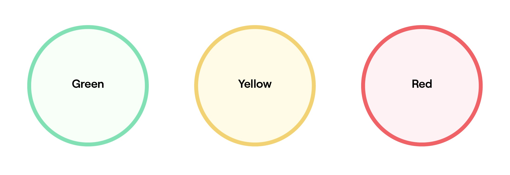
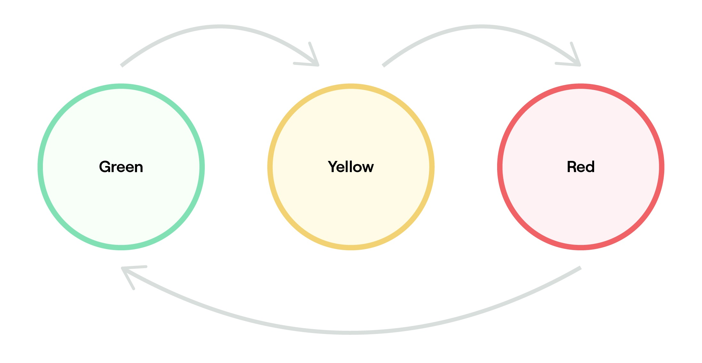
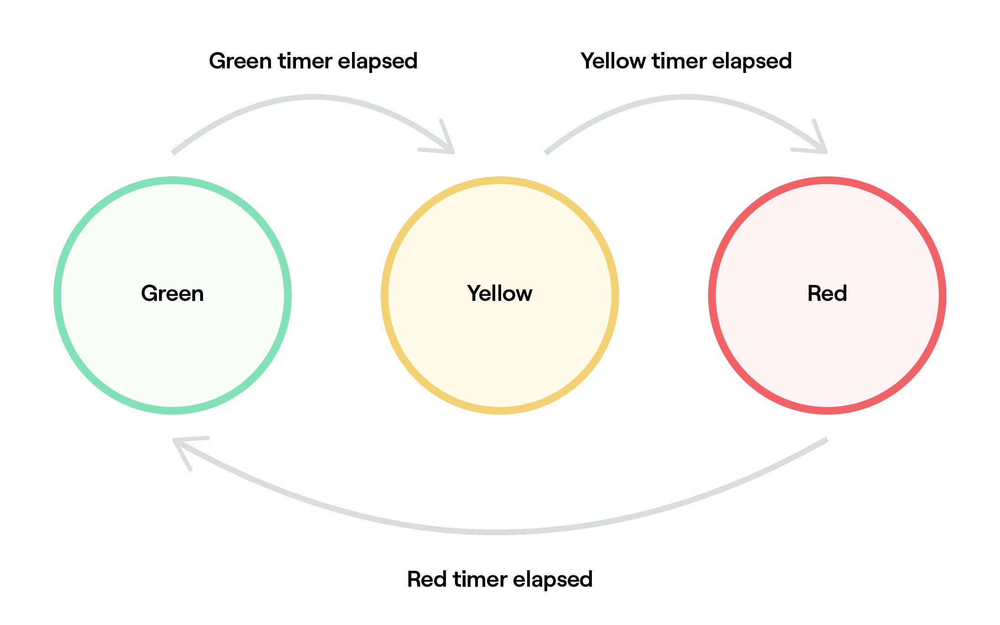

# Using Finite State Machine in PHP

I did some tests to apply finite state machines in PHP, and I think it would be nice to share this knowledge for anyone who thinks it might be useful. ;)

Thanks [@peter279k](https://github.com/peter279k) for sharing this amazing [PHP State Machine](https://github.com/jagarsoft/php-state-machine) library.

## Concept

A _Finite State Machine_ (FSM) or _Finite Automaton_ is a mathematical model used to represent computer programs or logic circuits.
The concept is conceived as an abstract machine that must be in one of a finite number of states.
The machine is in only one state at a time, this state is called the current state.
A state stores information about the past, that is, it reflects changes since entering a state, at the beginning of the system, to the present moment.
A transition indicates a change of state and is described by a condition that must be fulfilled for the transition to occur.
An action is a description of an activity that must be performed at a given time.

Finite state machines are a powerful abstraction that can help you wrangle difficult flows of logic into a single, testable unit.

Also, you can think about it, as a double-entry array or State Transition Table indexed by current state and current event. Content will be the next state:

| Current State | Input | Next State | Output                                                       |
| ------------- | ----- | ---------- | ------------------------------------------------------------ |
| Locked        | coin  | Unlocked   | Unlocks the turnstile so that the customer can push through. |
|               | push  | Locked     | None                                                         |
| Unlocked      | coin  | Unlocked   | None                                                         |
|               | push  | Locked     | When the customer has pushed through, locks the turnstile.   |

Bound to the next state, you can set a action function that will be executed when event will be raised at the current state, after run, the new state will be set. In foremention example, output may be the action performed by bound function over some servomotor or something like that (save data, etc).

You can cancel the transition to the next state invoking cancelTransition within action function. Current state will be remain.

Action functions are atomic. If you fire new events in an action function, they will be enqueued, and their action functions, if any, will be invoked consecutively, every time action function return.

If you cancel transition within a nested event, subsequent events may fail if no alternative event is defined for the current state.

Unexpected events for the current state will throw an exception.

You can fire common event from any state, by defining a addCommonTransition with expected event and destination state only, but you must add all states yet.

As you learn about finite state machines – or FSMs – you’ll see them pop up everywhere in real life. Vending machines, turnstiles and elevators can all be modeled by using this technique.

Let’s get familiar with state machines by looking at a common example: the traffic light.

## Mapping out a finite state machine

We have a simple traffic that cycles through 3 states: green, yellow, and red. Since the sequence of these transitions is critical to the safety of motorists, we want to ensure that the order is always correct. To do so, let’s create a FSM to model this behavior.

State machines are represented by 2 definining characteristics:

1. Their states
2. Their transitions

To model our traffic light, let’s start by sketching out its states.


We’ve listed out every possible state, represented by circles.

Let’s add some arrows to show the transitions. In our case, green can transition to yellow, yellow can transition to red, and red can transition to green.


This representation already tells us a great deal about our traffic light. Notice how it’s impossible to move from red to yellow, or from yellow to green. This is exactly what we want.

At this point, it’s also helpful to indicate what causes these transitions to occur. Let’s assume our traffic light uses timers to indicate when it should change states. Each light is associated with a timer, and when the timer expires, the state changes.

With this in mind, let’s label the state transitions.


Now we have a state diagram we can work with! The next step is to see how this works in PHP.

## Installing

Clone this repository:

```bash
git clone https://github.com/arcostasi/php-fsm
```

By _Composer_, just issue next command:

```bash
composer install
```

or if you don't have a composer installation:

[Get Composer](https://getcomposer.org/download/)

## Getting started

```bash
composer start
```

Output:

```bash
My current state is GREEN on event 1 and YELLOW will be the next state
Green timer elapsed: 6 seconds

My current state is YELLOW on event 2 and RED will be the next state
Yellow timer elapsed: 3 seconds

My current state is RED on event 3 and GREEN will be the next state
Red timer elapsed: 5 seconds

[ Press <CTRL+C> to exit the loop ]
```

## Credits

- [PHP State Machine implementation](https://packagist.org/packages/jagarsoft/php-state-machine) by [(R)JA.GAR. Soft](https://github.com/jagarsoft).
- [Finite State Machines in Swift](https://schoolofswift.com/articles/state-machines-101) from **School of Swift**.
- [Finite-state machine](https://en.wikipedia.org/wiki/Finite-state_machine) from **Wikipedia**, the free encyclopedia.

## Licence

GNU General Public License v2.0 only
